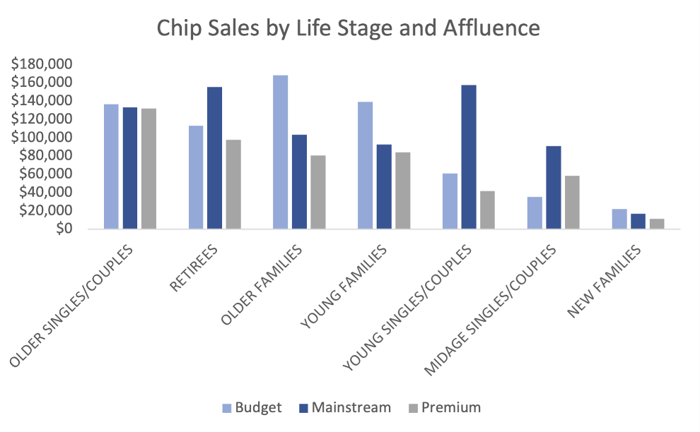
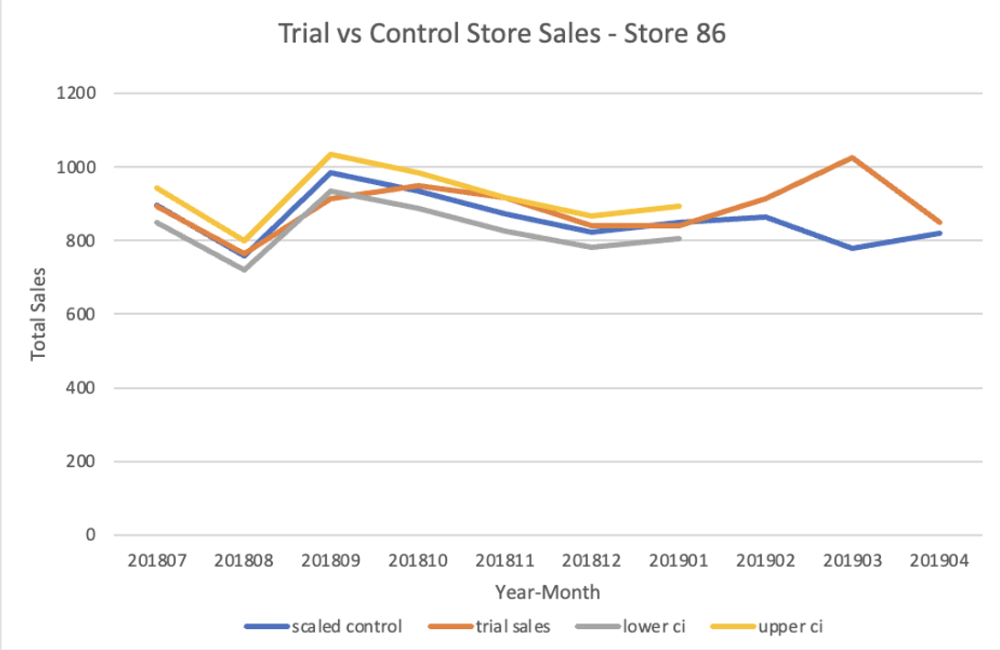
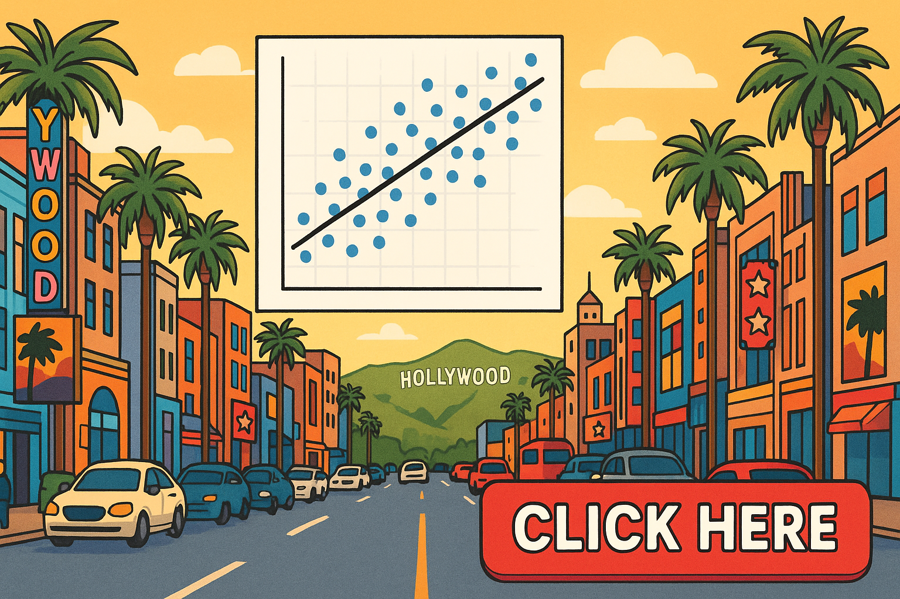
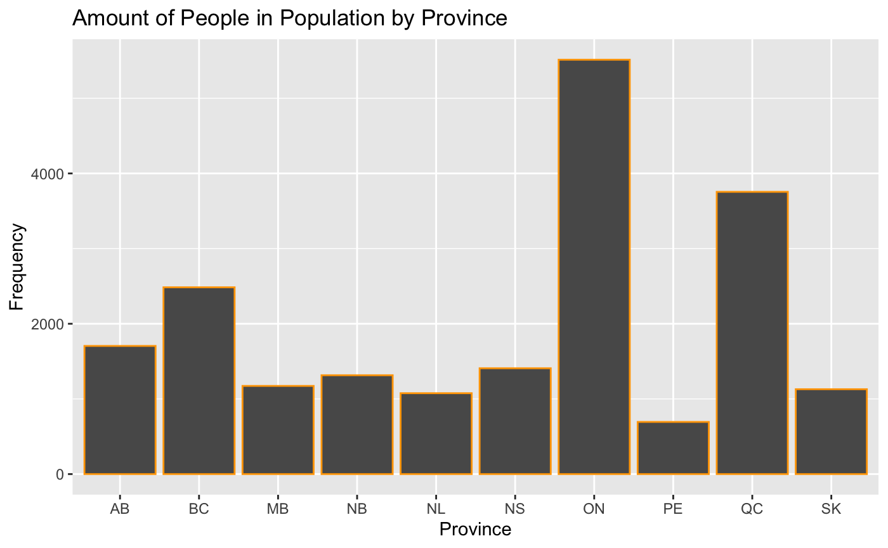
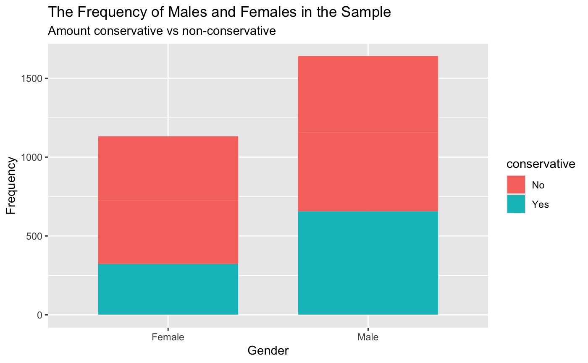
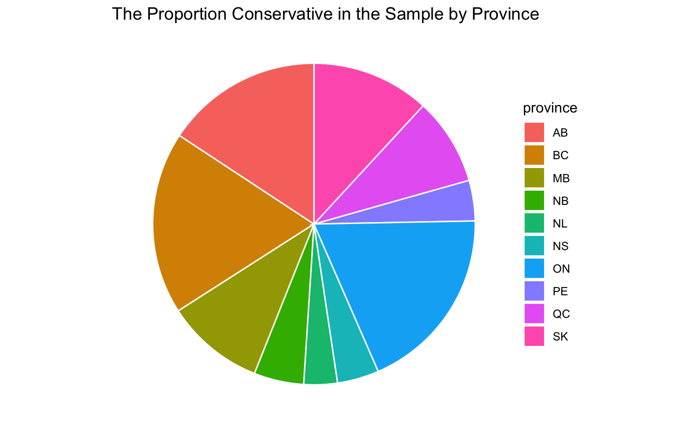

# Tayla's Projects 

## Retail Trial Analysis – Chip Category

### Business Question

Did a store-level chip trial generate a true performance uplift, and which customer segments drive category growth?

### Context

Using transaction-level and customer segmentation data, I evaluated purchasing behaviour and measured trial performance against carefully selected control stores. The analysis was completed entirely in Excel to simulate a real-world retail analytics workflow.

### Approach
- Cleaned and merged transaction + customer datasets
- Identified key customer segments (life stage × affluence)
- Selected comparable control stores using historical sales trends
- Measured uplift using scaled comparisons and confidence intervals
  
### Sales Contribution by Customer Segment

Mainstream and Budget families contributed the majority of chip sales, indicating trial success would depend heavily on family-dense store demographics.

### Trial vs Control Comparison

Statistically significant uplift observed in Store 78, suggesting genuine performance improvement rather than random variation.

### Recommendations 

- Roll out the trial selectively to stores with similar customer profiles
- Focus expansion on stores most comparable to the strongest-performing trial store
- Use further trials to test pricing or promotional strategies
- Continue monitoring performance to ensure consistent execution

## Video: Selecting the Best Predictor for the Median Housing Value of Calfornia Homes 

## Predicting Conservative Vote Share – Canadian Federal Election

### Business Question

What proportion of people will vote conservative in the upcoming federal election?

### Data Used

2019 Canadian Election Study (CES) – voter demographics and party preference
2017 General Social Survey (GSS) – population demographics for weighting

### What I Did

Using survey data and census-based population weighting, I built a logistic regression model to estimate national Conservative vote share.

### Provincial Weight Distribution

Ontario and Quebec heavily influence national vote share due to population size.

### Gender vs Conservative Support

Male respondents showed higher probability of Conservative support across most age groups. 

### Conservative Support by Province

## Forecasting New York Harbor Gas Prices

### Business Question

Can historical price patterns and volatility behavior improve short-term fuel price forecasting?

### Context

Using 40 years of weekly gasoline price data, I modeled price trends and volatility dynamics to evaluate forecast reliability and market risk persistence.

### New York Harbour Gas Prices 1988-2026

### Approach

- Log transformation + differencing to achieve stationarity
- ARIMA modeling for mean dynamics
- Rolling out-of-sample validation
- GARCH(1,1) modeling to capture volatility clustering

### Insights 
- Gas prices exhibit strong volatility clustering.
- Volatility shocks persist ~8 weeks (GARCH half-life).
- Forecast uncertainty expands rapidly during turbulent periods.
- Model performance indicates strong short-term predictive reliability (RMSE ≈ 0.047).

