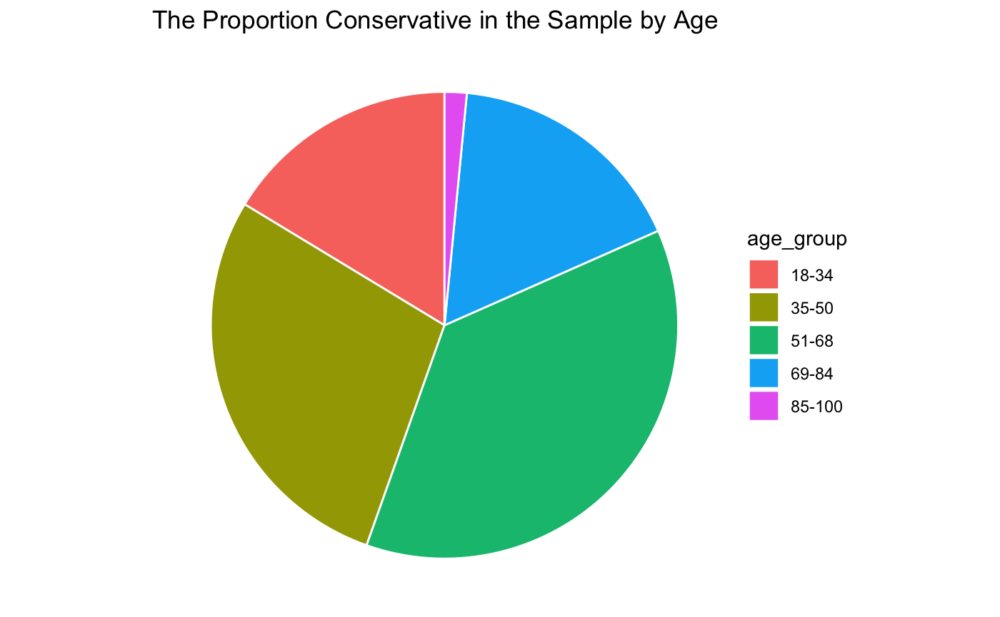

# Tayla's University Projects 

## Video Project: Selecting the Best Predictor for the Median Housing Value of Calfornia Homes 

description

## Predicting the Porportion of Votes of the Most Popular Canadian Party for the Federal Election

### Introduction 

The objective of this report is to predict the overall popular vote of the next Canadian federal 
election with the use of a logistic regression model and a post-stratification technique. 
The target population of this study is the Canadian citizens that will vote in the 2023 election.
Furthermore, the survey data used in the study was obtained from the 2019 Canadian Election Study 
dataset that is available through their website. Moreover, General Social Survey data from 2017 
will be used as census data to model some population demographics. The post-stratification technique 
will be used to estimate the most popular Canadian party by partitioning the population into demographic 
cells, calculating a value for each cell and then combining the values with a weighted average.

### Data 

The Canadian Election Study (CES) surveys demographic factors and political preferences relevant to 
Canadian voters. The data, publicly available on the CES website, is collected through phone and web 
surveys; this study uses only the phone survey data. The CES gathered responses before and after the 
2019 federal election, though only the pre-election phase is analyzed here. During the election period, 
interviewers completed 4,021 surveys using a modified random-digit dialing method. 

The General Social Survey (GSS) aims to measure long-term social trends and supply data for social and
political analysis. It targets non-institutionalized Canadians aged 14 and older across all provinces, 
reaching both cell phone and landline users. A stratified probability sample by province was used, 
ensuring minimum sample sizes to capture provincial variability. Approximately 34,000 Canadians were 
contacted, and about 20,000 completed the survey.

#### Data Cleaning 

To clean the GSS survey data, responses to Question 11 (“Which party do you think you will likely vote for?”) 
were first filtered so that only those selecting a valid party option (1–6) were kept. The dataset was 
then restricted to respondents who identified as male or female, since these were the only gender categories 
represented in the census data, and because gender will be used as a predictor in the regression model. 
Observations from the Northwest Territories and Yukon were removed because these territories were not 
included in the census dataset. Gender categories were recoded as “Male”/“Female” to match the census format.
An age variable was created by subtracting birth year from 2019, and a variable to indicate conservative 
support was created.

For the CES census data, ages were rounded to whole numbers, individuals under 18 were removed, and the variable 
“sex” was renamed to “gender.” Provincial names were recoded numerically to align with the survey data, 
and all columns except gender, age, and province were dropped.

#### Variables Description 

The variables that are included in the study are age, gender, province, support_cons, cons_proportion. 
The ages range from 18 to 100 as 18 is the minimum age to vote in Canada. The gender variable can only 
take on “Male” or “Female” due to the constraints in the census data. The province variable takes on values 
1 to 10 that represent Newfoundland and Labrador, Prince Edward Island, Nova Scotia, New Brunswick, Quebec, O
ntario, Manitoba, Saskatchewan, Alberta and British Columbia respectively. The variable support_cons is an 
indicator variable that takes on a value of 1 or 0, 1 is taken if the individual supports the conservative 
party and 0 if they do not. Further, the cons_proportion variable gives the proportion of conservative voters 
in the data or the sum of conservative voters over the entire population. 

#### Distribution of the data 

The plot depicts the frequencies of people in the census data by province. Ontario and Quebec
will have the greatest influence on the proportion of conservative votes. 

The plot depicts the relationship between gender and conservative political beliefs. The bar graph shows
the frequency of males and females the survey data set. 

The pie graph that illustrates the proportion of people who voted conservative
by the total number of conservative votes by age group. The age group 85-100 has the smallest number
of conservative and this is likely because this age group made up the smallest proportion of people in the
survey (there are only 35 people in this age group). 

The plot is another pie graph that showcases the conservative support by province. Provinces with
more people have a larger weight in the pie.

### Methods

the model will predict whether or not someone will vote conservative based on demographics from the census 
data. A Logistic regression model is a statistical model that can model a binary response variable 
using a log function. the data showed trends with age and gender political beliefs, so they were chosen 
as predictor variables. Age is a numerical predictor and gender is a categorical predictor coded using as.factor. 
 The finite population correction was implemented to fix the standard error estimates so
they reflect the target population better. The logistic model was created using the svyglm function with
the binomial family to ensure the response is binary. The outcome of the logistic regression model gives the
log likelihood of an individual to vote conservative based off their age and gender. This likelihood can be
rearranged as the probability of that individual to vote conservative.

y = -1.4739 + 0.0107x(age) + 0.5272I(male) + e

The poststratification process creates a weighted average based off of the proportions of the demographic 
in the population. the post enables that each group in the demographic is properly represented in the sample so 
can make better predictions on population.

Using the logistic model, conservative support probabilities were computed for every individual in the census data. The census data were then grouped by province, provincial cell totals were calculated, and each estimated probability was weighted by its province’s population. Provincial weighted means were obtained, then summed and divided by the national population to estimate the overall proportion of conservative voters.

This produced an estimated conservative vote proportion of 0.347, assuming census data are representative of 2023 voters and that age and gender adequately predict conservative support. This value also represents the weighted probability of conservative votes based by
province.

### Results 

### Bibliography

1. Stephenson, Laura B; Harell, Allison; Rubenson, Daniel; Loewen, Peter John. (2020) 2019 Canadian
Election Study - Phone Survey Technical Report.pdf, 2019 Canadian Election Study - Phone Survey,
https://doi.org/10.7910/DVN/8RHLG1/1PBGR3, Harvard Dataverse, V1
2. Government of Canada, S. C. (2019, February 6). General Social Survey - Family (GSS). Surveys and
statistical programs. https://www23.statcan.gc.ca/imdb/p2SV.pl?Function=getSurvey&SDDS=450.
3. Holtz, Y. (n.d.). ggplot2 Piechart. – the R Graph Gallery.https://www.r-graph-gallery.com/piechart-
ggplot2.html.

## Heart Disease Paper

## Forecasting New York Harbor Gas Prices

### Introduction

Gasoline makes up nearly half of U.S. oil consumption and is the largest refined product sold 
domestically (TradingEconomics). The U.S. Energy Information Administration (EIA) reports 
weekly, monthly, and annual gas prices using an unweighted average of daily prices. This study 
analyzes the weekly New York Harbor conventional regular gasoline dataset (in cents per gallon), 
covering 2000 to mid-2010 with 575 observations.

A time series is a sequence of observations recorded in time order. The goal of this analysis is to examine how current gas price trends influence future prices and to develop a statistical model that captures the temporal dependence between observations.

Figure 1. 

### Statistical Methods

The plot of the gasoline data (Figure 1) shows a strong upward trend. Although a simple 
linear regression, xₜ = −33899.69 + 16.98zₜ + wₜ,can estimate this trend, it does not
capture the key time-dependent structure. Autoregressive and moving-average components, 
combined in ARMA models, are better suited because they model relationships between current and 
past values. The ARMA model regresses the present outcome xt on the past outcomes 
(xt-l, ..., xt-p) with correlated errors.  

The clear upward trend of the gas data shows that the series is not stationary. 
Differencing the data yields a stationary process such that the first difference eliminates a 
linear trend, the second difference eliminates a quadratic trend, and so on.

Figure 2. 

#### Satisfying Stationarity 

After taking the first difference of gas data, the next step was to assess if the series is stationary.
The ACF decayed slowly (Figure 2), indicating that additional differencing was needed. After 
taking the second difference, the series had a stable mean near zero, relatively constant variance, 
and an ACF that decayed quickly. Thus, the second difference has made the gas prices data stationary.

#### Estimating Model Parameters 

Because the data required two differences, we set d = 2 in the ARIMA(p, d, q) model. Examining the ACF 
and PACF of the twice-differenced series, the ACF cuts off at lag 1 and the PACF tails off, suggesting 
an ARIMA(0, 2, 1). Alternatively, the PACF appears to cut off at lag 5 while the ACF tails off, 
suggesting an ARIMA(5, 2, 0).

Figure 3. Decomposed Time Series 

The decomposition indicates a yearly seasonal pattern, implying a seasonal ARIMA may be appropriate. 
The ACF shows a seasonal cutoff at lag 1s (s = 52 weeks), while the PACF tails off at seasonal lags, 
suggesting SMA(1) with P = 0, Q = 1. At non-seasonal lags, the ACF cuts off at 1 and the PACF tails 
off, giving p = 0, q = 1. Thus, a reasonable seasonal model is ARIMA(0, 1, 1) × (0, 1, 1)_{52}.

### Results

#### Model Selection

For ARIMA(0, 2, 1), the estimate θ₁ = −1 violates invertibility, making the 
model unsuitable.

The ARIMA(5, 2, 0) model yields:
xₜ = −0.7955xₜ₋₁ − 0.6043xₜ₋₂ − 0.3416xₜ₋₃ − 0.1995xₜ₋₄ − 0.1047xₜ₋₅ + wₜ
Here, the forecast depends on the previous five observations. 

The seasonal ARIMA(0, 1, 1) × (0, 1, 1)_{52} also fails because its seasonal 
MA(1) coefficient is −1, again violating invertibility.

Other seasonal ARIMA models were tested on the gas data by altering one dependence at a 
time and then checking if they satisfied the model assumptions. In both of the seasonal 
models ARIMA(1, 1, 1)x(1, 1, 2)52 and ARIMA( 2, 1, 2)x(0, 1, 1)52, all of the coefficients 
or were significant. 

 

Model adequacy was assessed using standardized residuals, q–q plots for normality, and 
Ljung–Box tests for independence. These diagnostics were used to evaluate all proposed 
and alternative models.

 

Two models satisfied ARIMA assumptions:
- ARIMA(1, 1, 1) × (1, 1, 2)_{52}
- ARIMA(2, 1, 2) × (0, 1, 1)_{52}

Using AIC, AICc, and BIC for comparison, ARIMA(2, 1, 2) × (0, 1, 1)_{52} performed best
and was selected for forecasting weekly New York Harbor gas prices.

#### Forecast and Prediction Intervals

The gas prices for the next ten weeks were forecasted using the seasonal ARIMA model. The next
10 weeks are the 26th week to the 35th week of 2010. The figure 7 includes a 95% and 90%
prediction interval that is a range of plausible values for gas price in these 10 weeks. The large 
and quickly increasing prediction intervals show that the gas prices could increasing or
decreasing at any time.

### Discussion

The New York Harbor conventional regular gasoline weekly spot price can be modeled a seasonal ARIMA:
ARIMA(2, 1, 2) × (0, 1, 1)_{52}. Seasonal persistence occurs as the yearly gas prices are nearly
periodic in the weeks of the year. This model is suitable for forecasting gas prices in this
specific region, but its applicability is limited: other regions have different economic and 
geographic factors that shape price dynamics. Long-term forecasts are also unreliable, as future 
structural changes (e.g., recessions, geopolitical events) could drastically alter price behavior.
Periodic model updates with recent data are therefore necessary for maintaining predictive accuracy.

### Bibliography

1. EIA. (n.d.) Energy Information Administration - EIA - independent statistics and
analysis. About EIA - U.S. Energy Information Administration (EIA) .U.S.EnergyIn-
formation Administration (EIA). https://www.eia.gov/about/. (Last Accessed: April
17, 2022)
2. Trading Economics. (n.d.) Gasoline2022 data - 2005-2021 historical - 2023 forecast
- price - quote - chart. Gasoline - 2022 Data - 2005-2021 Historical - 2023 Forecast
- Price - Quote - Chart.. https://tradingeconomics.com/commodity/gasoline (Last
Accessed: April 17, 2022)
3. YCharts. (n.d.) US Retail Gas Price. https://ycharts.com/indicators/us_gas_price.
(Last Accessed: April 17, 2022)
