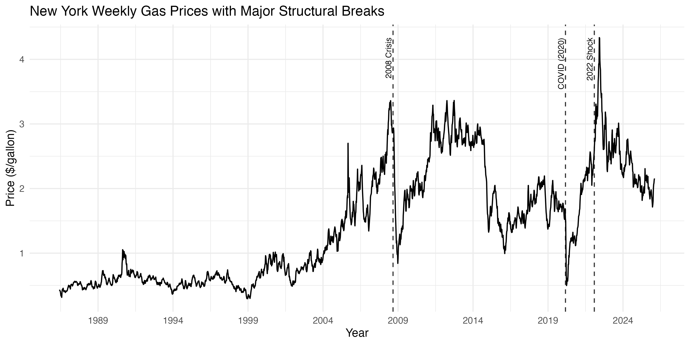
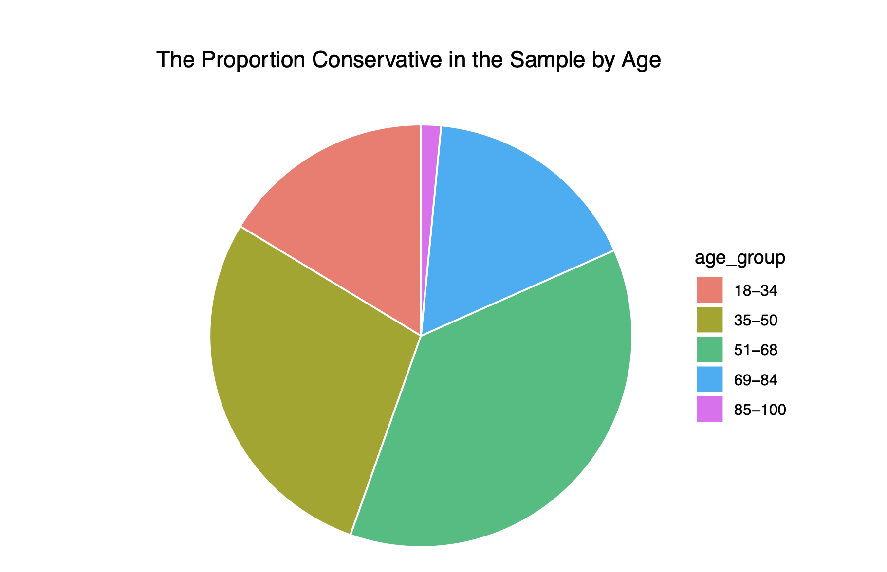

# About me 

Statistics graduate specializing in time series forecasting, regression modeling, and data visualization. I build interpretable models that translate complex data into clear business insights.

# Featured Projects 

- Retail Trial Analysis (Excel) 
- Gas Price Forecasting (R) 
- Election Vote Modeling (R)
- Modeling House Prices (R) 

# Retail Trial Analysis

### Business Question

Did a store-level chip trial generate a true performance uplift, and which customer segments drive category growth?

### Context

Using transaction-level and customer segmentation data, I evaluated purchasing behaviour and measured trial performance against carefully selected control stores. The analysis was completed entirely in Excel to simulate a real-world retail analytics workflow.

### Approach
- Cleaned and merged transaction + customer datasets
- Identified key customer segments (life stage × affluence)
- Selected comparable control stores using historical sales trends
- Measured uplift using scaled comparisons and confidence intervals
  
### Sales Contribution by Customer Segment

Mainstream products dominate chip sales across most life stages, with particularly strong performance among Older Families and Young Singles/Couples.

### Trial vs Control Comparison

During the trial period, Store 86 delivered a +13% sales uplift vs its scaled control, indicating a meaningful improvement attributable to the trial intervention. (13% = trial sales were 13% higher than expected based on the scaled control benchmark.)

### Recommendations 

- Roll out the trial selectively to stores with similar customer profiles
- Focus expansion on stores most comparable to the strongest-performing trial store
- Use further trials to test pricing or promotional strategies
- Continue monitoring performance to ensure consistent execution

### Business Impact 

This framework provides a structured approach for evaluating retail trials with statistical confidence before large-scale rollout.

# Forecasting New York Harbor Gas Prices

### Business Question

Can historical price patterns and volatility behavior improve short-term fuel price forecasting?

### Context

Using 40 years of weekly gasoline price data, I modeled price trends and volatility dynamics to evaluate forecast reliability and market risk persistence.

### New York Harbor Gas Prices 1988-2026 Forcasted

This plot shows the ARIMA-based forecast of weekly New York gas prices, including a 95% prediction interval. The widening confidence band reflects increasing uncertainty over longer forecast horizons. The model captures long-term persistence in prices while acknowledging the high variability characteristic of energy markets.

### Structural Breaks in Gas Prices

This chart highlights major structural breaks in the gas price series, including the 2008 financial crisis, the 2020 COVID shock, and the 2022 geopolitical energy shock. These regime shifts explain large deviations from historical trends and reinforce the importance of modeling both mean dynamics and volatility.
### Approach

- Log transformation + differencing to achieve stationarity
- ARIMA modeling for mean dynamics
- Rolling out-of-sample validation
- GARCH(1,1) modeling to capture volatility clustering

### Insights 
- Gas prices exhibit statistically significant volatility clustering, indicating persistent risk shocks.
- GARCH(1,1) results show volatility persistence (α + β ≈ 0.97), with shocks decaying over approximately 8 weeks, indicating prolonged periods of elevated risk.
- Forecast uncertainty expands rapidly during turbulent periods.
- Out-of-sample validation yielded RMSE ≈ 0.047, indicating strong short-term predictive performance relative to weekly price variation.

# Predicting Conservative Vote Share in the Canadian Federal Election

### Business Question

What proportion of voters are expected to support the Conservative Party based on demographic patterns?

### Data Used

2019 Canadian Election Study (CES) – voter demographics and party preference
2017 General Social Survey (GSS) – population demographics for weighting

### What I Did

Using survey data and census-based population weighting, I built a logistic regression model to estimate national Conservative vote share.

### Provincial Weight Distribution

Ontario and Quebec heavily influence national vote share due to population size.

### Gender vs Conservative Support

Male respondents showed a higher support rate (41%) compared to females (29%), suggesting gender plays a meaningful role in conservative voting probability.

### Conservative Support by Province

Conservative support increases with age, peaking around 40% among respondents aged 51–68.

### Key Result

The model estimated approximately 34.7% Conservative vote share, after applying provincial demographic weighting.

# Video Project: Selecting the Best Predictor for the Median Housing Value of Calfornia Homes 

### Business Question

Which variable best predicts median home value across California districts?

### Overview 

Using regression analysis, I evaluated multiple predictors and assessed model performance to determine the strongest explanatory variable.

### Key Insight

Median income emerged as the strongest predictor of housing value, explaining a substantial proportion of variance across districts.

