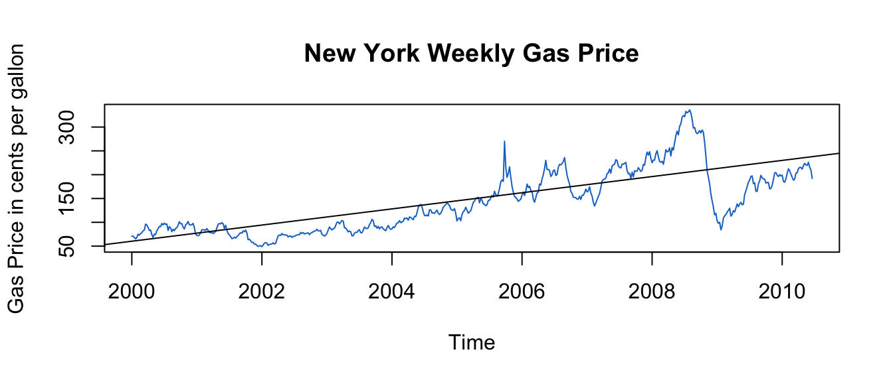
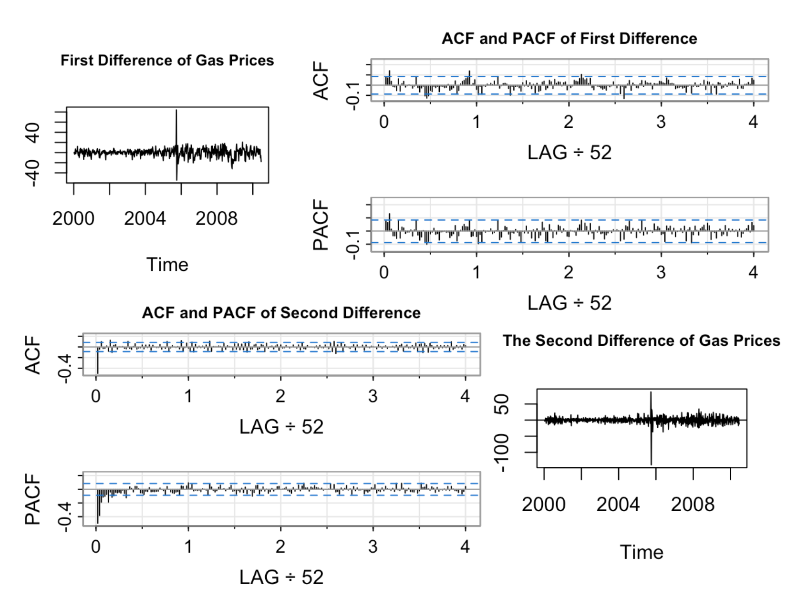
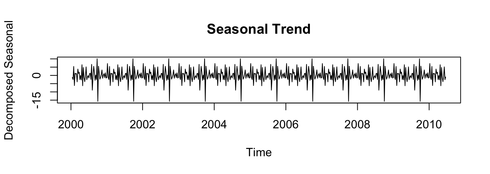
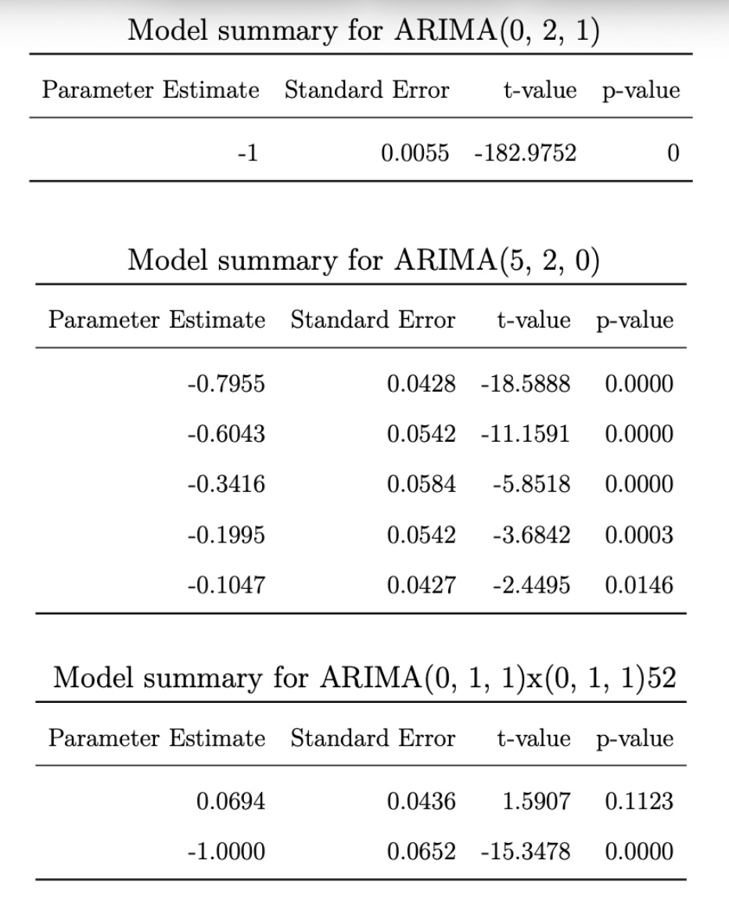
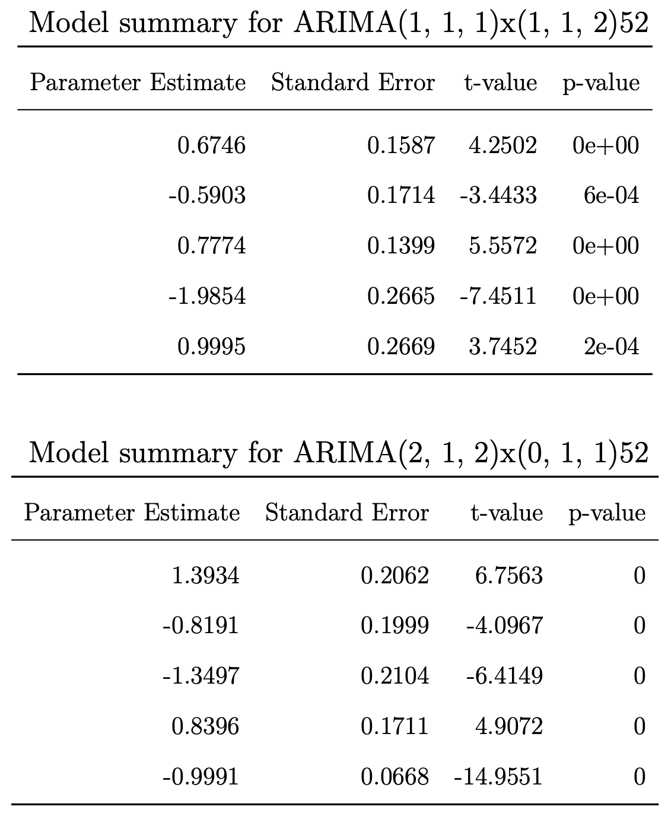
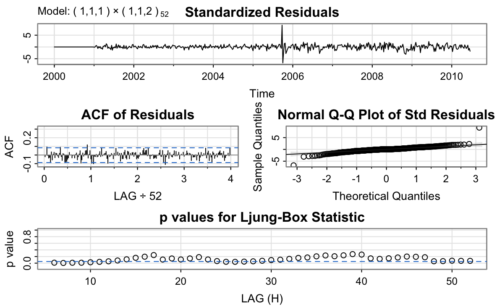
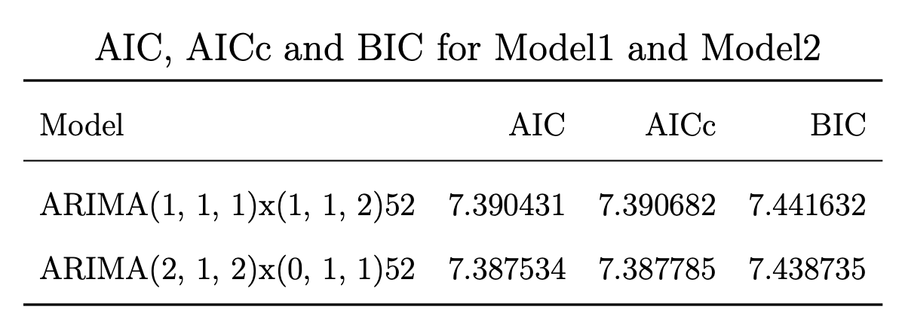
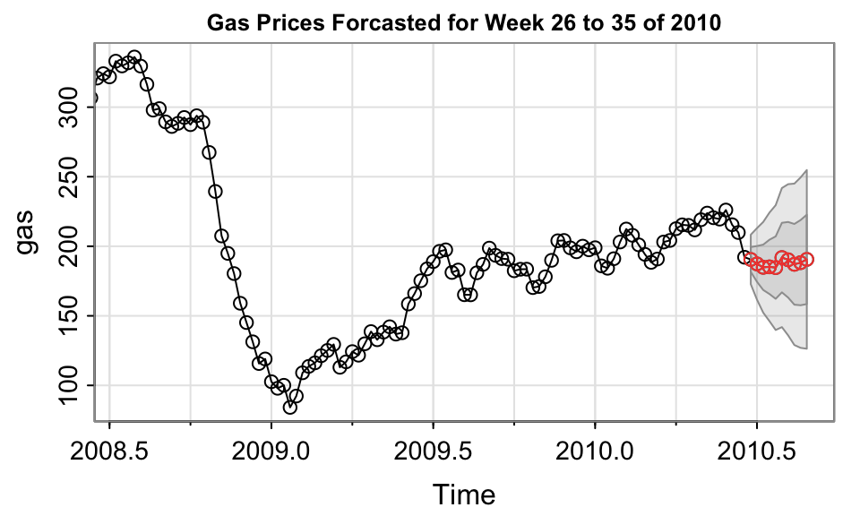

# Tayla's University Projects 

### Heart Disease Paper

### Video Project 

### Result of Canadian Federal Election

### Gas Prices

#### Introduction

Gasoline makes up nearly half of U.S. oil consumption and is the largest refined product sold domestically (TradingEconomics). The U.S. Energy Information Administration (EIA) reports weekly, monthly, and annual gas prices using an unweighted average of daily prices. This study analyzes the weekly New York Harbor conventional regular gasoline dataset (in cents per gallon), covering 2000 to mid-2010 with 575 observations.

A time series is a sequence of observations recorded in time order. The goal of this analysis is to examine how current gas price trends influence future prices and to develop a statistical model that captures the temporal dependence between observations.

Figure 1. 

##### Statistical Methods

The plot of the gasoline data (Figure 1) shows a strong upward trend. Although a simple 
linear regression, xₜ = −33899.69 + 16.98zₜ + wₜ,can estimate this trend, it does not
capture the key time-dependent structure. Autoregressive and moving-average components, 
combined in ARMA models, are better suited because they model relationships between current and 
past values. The ARMA model regresses the present outcome xt on the past outcomes 
(xt-l, ..., xt-p) with correlated errors.  

The clear upward trend of the gas data shows that the series is not stationary see figure 1. 
Differencing the data yields a stationary process such that the first difference eliminates a 
linear trend, the second difference eliminates a quadratic trend, and so on.

Figure 2. 

##### Satisfying Stationarity 

After taking the first difference of gas data, the next step was to assess if the series is stationary.
The ACF decayed slowly (Figure 2), indicating that additional differencing was needed. After 
taking the second difference, the series had a stable mean near zero, relatively constant variance, 
and an ACF that decayed quickly. Thus, the second difference has made the gas prices data stationary.

##### Estimating Model Parameters 

Because the data required two differences, we set d = 2 in the ARIMA(p, d, q) model. Examining the ACF 
and PACF of the twice-differenced series, the ACF cuts off at lag 1 and the PACF tails off, suggesting 
an ARIMA(0, 2, 1). Alternatively, the PACF appears to cut off at lag 5 while the ACF tails off, 
suggesting an ARIMA(5, 2, 0).

Figure 3. Decomposed Time Series 

The decomposition indicates a yearly seasonal pattern, implying a seasonal ARIMA may be appropriate. 
The ACF shows a seasonal cutoff at lag 1s (s = 52 weeks), while the PACF tails off at seasonal lags, 
suggesting SMA(1) with P = 0, Q = 1. At non-seasonal lags, the ACF cuts off at 1 and the PACF tails 
off, giving p = 0, q = 1. Thus, a reasonable seasonal model is ARIMA(0, 1, 1) × (0, 1, 1)_{52}.

#### Results

##### Model Selection

For ARIMA(0, 2, 1), the estimate θ₁ = −1 violates invertibility, making the 
model unsuitable.

The ARIMA(5, 2, 0) model yields:
xₜ = −0.7955xₜ₋₁ − 0.6043xₜ₋₂ − 0.3416xₜ₋₃ − 0.1995xₜ₋₄ − 0.1047xₜ₋₅ + wₜ
Here, the forecast depends on the previous five observations. 

The seasonal ARIMA(0, 1, 1) × (0, 1, 1)_{52} also fails because its seasonal 
MA(1) coefficient is −1, again violating invertibility.

Other seasonal ARIMA models were tested on the gas data by altering one dependence at a 
time and then checking if they satisfied the model assumptions. In both of the seasonal 
models ARIMA(1, 1, 1)x(1, 1, 2)52 and ARIMA( 2, 1, 2)x(0, 1, 1)52, all of the coefficients 
or were significant. 

 

Model adequacy was assessed using standardized residuals, q–q plots for normality, and 
Ljung–Box tests for independence. These diagnostics were used to evaluate all proposed 
and alternative models.

 

Two models satisfied ARIMA assumptions:
- ARIMA(1, 1, 1) × (1, 1, 2)_{52}
- ARIMA(2, 1, 2) × (0, 1, 1)_{52}

Using AIC, AICc, and BIC for comparison, ARIMA(2, 1, 2) × (0, 1, 1)_{52} performed best
and was selected for forecasting weekly New York Harbor gas prices.

##### Forecast and Prediction Intervals

The gas prices for the next ten weeks were forecasted using the seasonal arima model. The next
10 weeks are the 26th week to the 35th week of 2010. The figure 7 includes a 95% and 90%
prediction interval that is a range of plausible values for gas price in these 10 weeks. 
Due to the double differencing the forecasts follow the recent trend in the data. The large and 
quickly increasing prediction intervals show that the gas prices could increasing 
or decreasing at any time.

#### Discussion

The New York Harbor conventional regular gasoline weekly spot price can be modeled a seasonal ARIMA:
ARIMA(2, 1, 2) × (0, 1, 1)_{52}. Seasonal persistence occurs as the yearly gas prices are nearly
periodic in the weeks of the year. This model is suitable for forecasting gas prices in this
specific region, but its applicability is limited: other regions have different economic and 
geographic factors that shape price dynamics. Long-term forecasts are also unreliable, as future 
structural changes (e.g., recessions, geopolitical events) could drastically alter price behavior.
Periodic model updates with recent data are therefore necessary for maintaining predictive accuracy.

#### Bibliography

1. EIA. (n.d.) Energy Information Administration - EIA - independent statistics and
analysis. About EIA - U.S. Energy Information Administration (EIA) .U.S.EnergyIn-
formation Administration (EIA). https://www.eia.gov/about/. (Last Accessed: April
17, 2022)
2. Trading Economics. (n.d.) Gasoline2022 data - 2005-2021 historical - 2023 forecast
- price - quote - chart. Gasoline - 2022 Data - 2005-2021 Historical - 2023 Forecast
- Price - Quote - Chart.. https://tradingeconomics.com/commodity/gasoline (Last
Accessed: April 17, 2022)
3. YCharts. (n.d.) US Retail Gas Price. https://ycharts.com/indicators/us_gas_price.
(Last Accessed: April 17, 2022)
