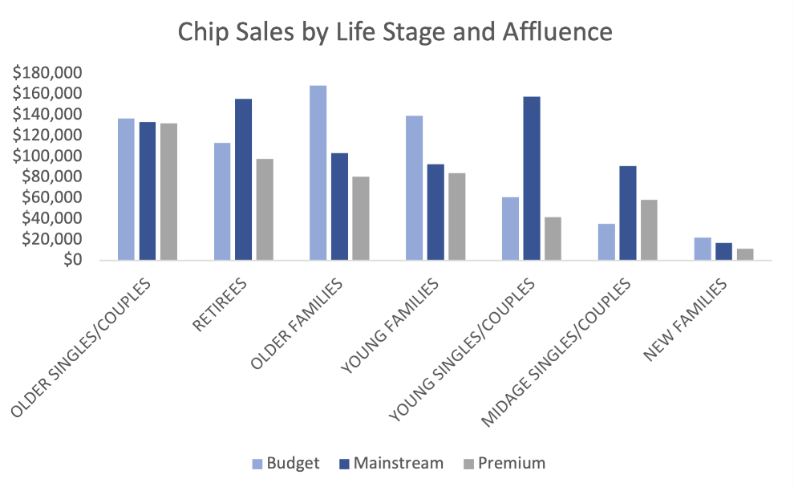
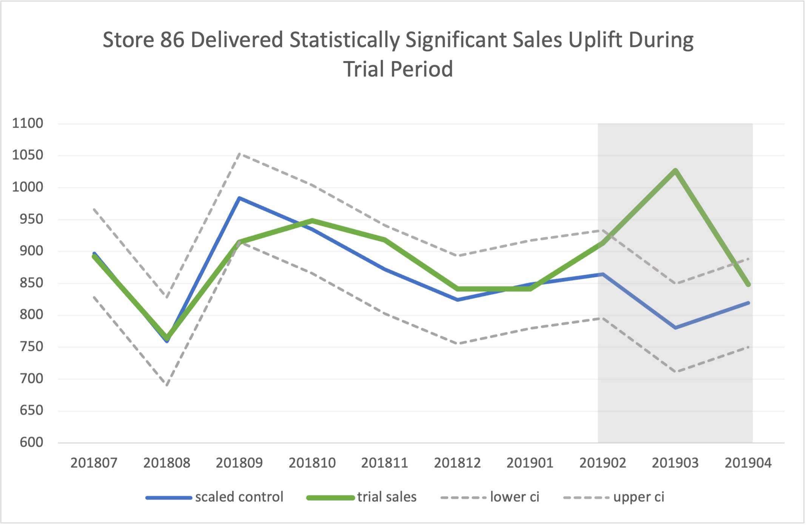
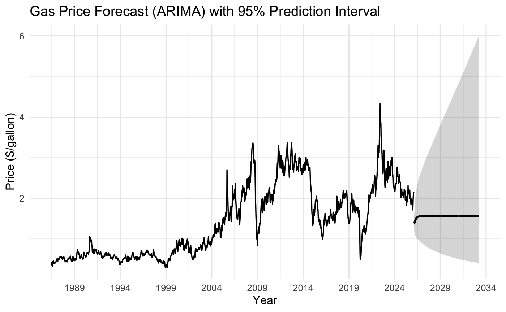
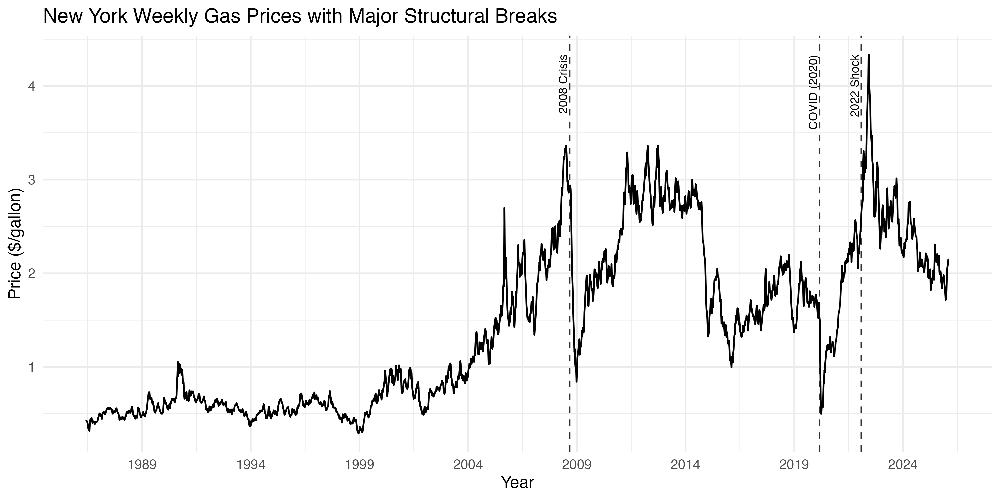
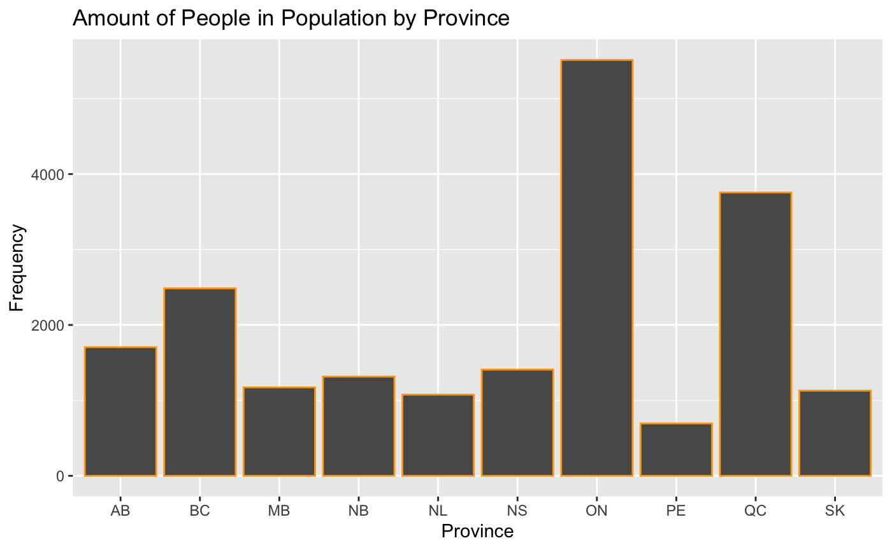
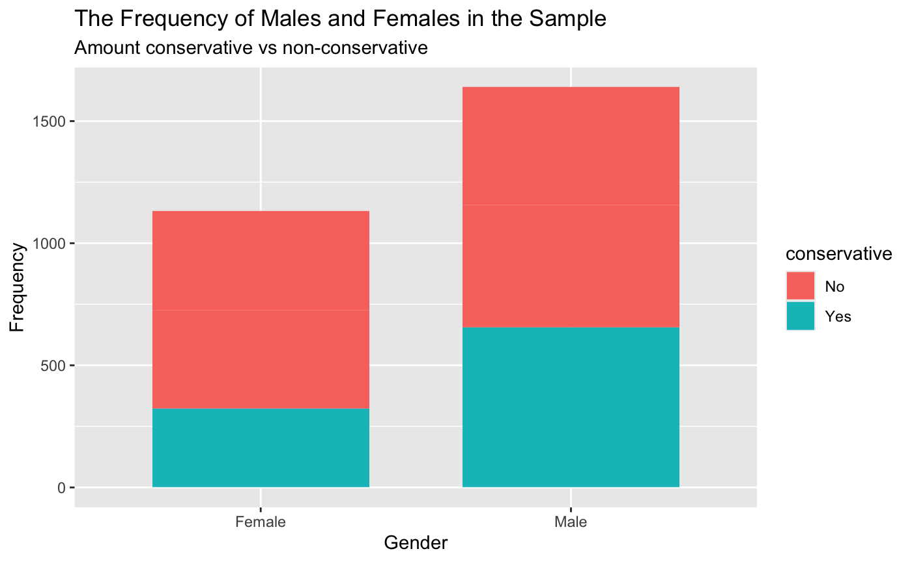
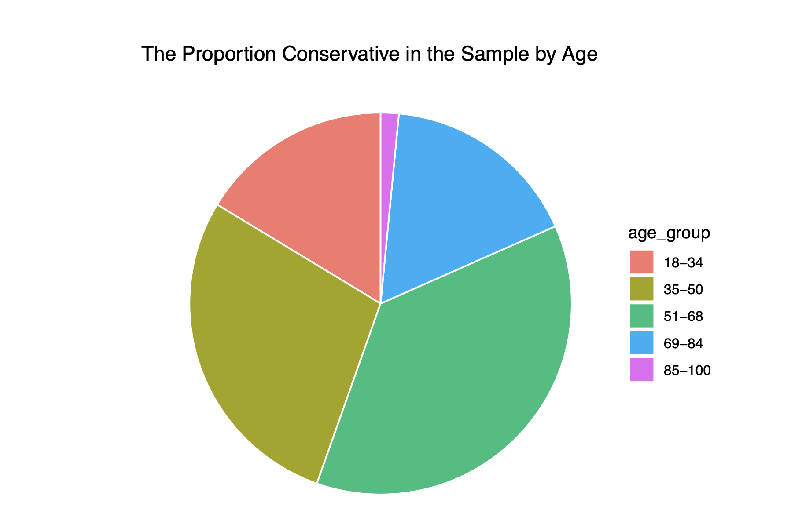
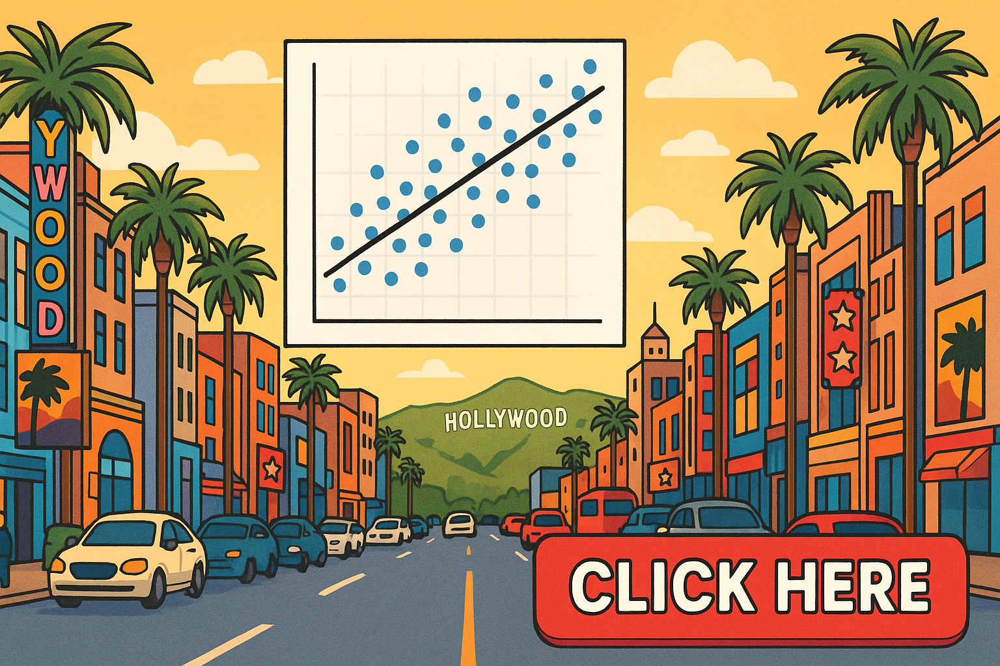

# Tayla's Data Projects
## About me 

I’m a Statistics graduate from the University of Toronto with a strong interest in data analysis.

I’ve worked with Excel, R, SQL, and Python to analyze datasets, build models, and evaluate performance, with a focus on producing clear insights. I’ve analyzed areas such as sales performance and trends over time, using structured approaches to solve problems and measure business impact.

I’m looking to start my career in data analytics, where I can keep building my skills and contribute to real business problems.

## Featured Projects 

- Retail Trial Analysis (Excel) 
- Gas Price Forecasting (R) 
- Election Vote Modeling (R)
- Modeling House Prices (R) 

# Retail Trial Analysis 

<a href="https://github.com/taystantim/-Chip-Category-Trial-Analysis" target="_blank">
  <button>View Full Project</button>
</a>

#### Overview

I analyzed supermarket transaction and customer data to evaluate a store-level chip trial and identify which customer groups drove sales growth. The analysis was completed in Excel using control store comparisons and confidence intervals.

#### What I Did

- Cleaned and merged transaction and customer datasets
- Analyzed chip sales by life stage and affluence
- Selected control stores using historical sales patterns
- Compared trial stores against scaled controls
- Used confidence intervals to assess whether uplift was statistically meaningful
  
#### Sales Contribution by Customer Segment

Mainstream products dominate chip sales across most life stages, with particularly strong performance among Older Families and Young Singles/Couples.

#### Trial vs Control Comparison

The trial generated approximately $324 in incremental revenue over the 3-month period for Store 86, representing a 13% uplift in category sales. The trial effect exceeded 3.05 standard deviations above historical pre-trial variation, indicating a large and statistically meaningful impact.

#### Key Insights 

- Mainstream and Budget families contributed the largest share of chip sales
- Budget customers purchased more frequently at lower price points
- The trial produced statistically significant uplift in some stores

#### Business Impact 

Demonstrates how trial performance can be evaluated before rollout using structured analysis and statistical validation.

#### Tools 

Excel, data cleaning, PivotTables, aggregation, control group analysis, confidence intervals

# Forecasting New York Harbor Gas Prices

<a href="https://github.com/taystantim/gas-price-forecasting" target="_blank">
  <button>View Full Project</button>
</a>

#### Overview

This project analyzed historical New York Harbor gasoline prices and built time-series models to forecast short-term price movements.

#### What I did 

- Explored trend and seasonality
- Differenced the series to achieve stationarity
- Used ACF and PACF to guide model selection
- Compared ARIMA and seasonal ARIMA models
- Generated 10-week forecasts with prediction intervals

#### New York Harbor Gas Prices 1988-2026

This plot shows the ARIMA-based forecast of weekly New York gas prices, including a 95% prediction interval. The widening confidence band reflects increasing uncertainty over longer forecast horizons. The model captures long-term persistence in prices while acknowledging the high variability characteristic of energy markets.

#### Structural Breaks in Gas Prices

This chart highlights major structural breaks in the gas price series, including the 2008 financial crisis, the 2020 COVID shock, and the 2022 geopolitical energy shock. These regime shifts explain large deviations from historical trends and reinforce the importance of modeling both mean dynamics and volatility.

#### Key Results 

- Produced short-term forecasts for 2010 gasoline prices using ARIMA(2,1,2) × (0,1,1)₅₂ model
- Forecast uncertainty widened quickly over time
- Results showed the difficulty of long-range commodity forecasting

#### Tools 

R, time series analysis, ARIMA/SARIMA, forecasting, residual diagnostics

# Predicting Conservative Vote Share in the Canadian Federal Election

<a href="https://github.com/taystantim/Predicting-Conservative-Vote-Share-in-the-Canadian-Federal-Election" target="_blank">
  <button>View Full Project</button>
</a>

#### Overview

This project used Canadian election and census data to estimate Conservative vote share using logistic regression and demographic weighting.

#### What I Did

- Cleaned and recoded survey variables
- Built a logistic regression model for Conservative support
- Applied provincial demographic weighting
- Visualized age, gender, and regional voting patterns

#### Provincial Weight Distribution

Ontario and Quebec heavily influence national vote share due to population size.

#### Gender vs Conservative Support

Male respondents showed a higher support rate (41%) compared to females (29%), suggesting gender plays a meaningful role in conservative voting probability.

#### Conservative Support by Province

Conservative support increases with age, peaking around 40% among respondents aged 51–68.

#### Key Results

- Estimated 34.7% Conservative vote share
- Found that province size strongly affects national outcomes
- Identified meaningful differences in support by age and gender

#### Tools 

R, logistic regression, weighting, survey data analysis, data visualization

# Video Project: Selecting the Best Predictor for the Median Housing Value of Calfornia Homes 

#### Overview 

This project used regression analysis to identify which variable best predicts median housing value across California districts.

#### What I Did 

- Compared multiple predictors using regression analysis
- Evaluated model fit and explanatory power
- Identified the strongest predictor of housing value

#### Key Insight

Median income emerged as the strongest predictor of housing value, explaining a substantial proportion of variance across districts.

#### Tools 

R, regression analysis, model evaluation, data visualization

