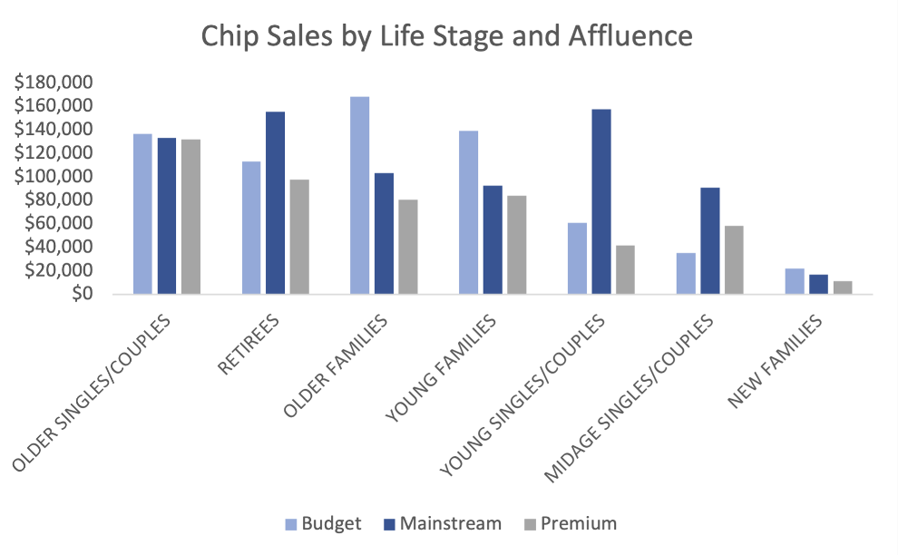
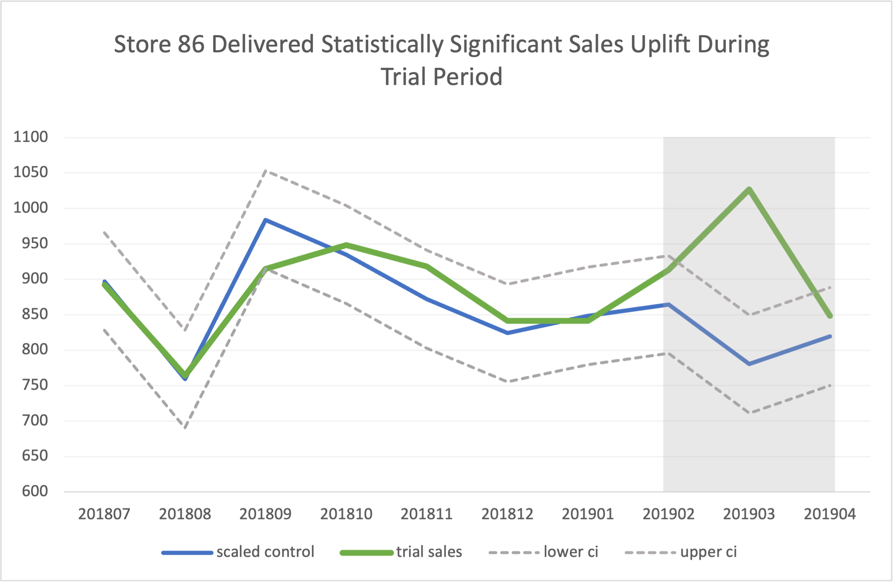
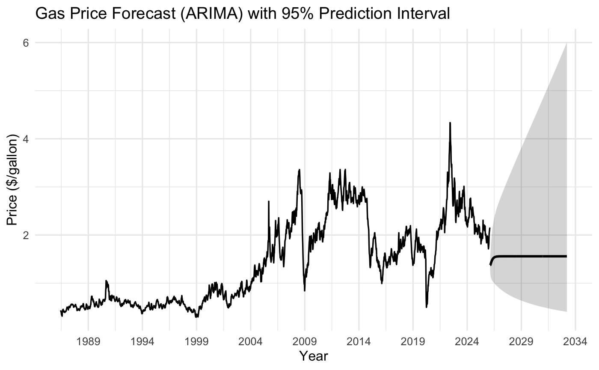
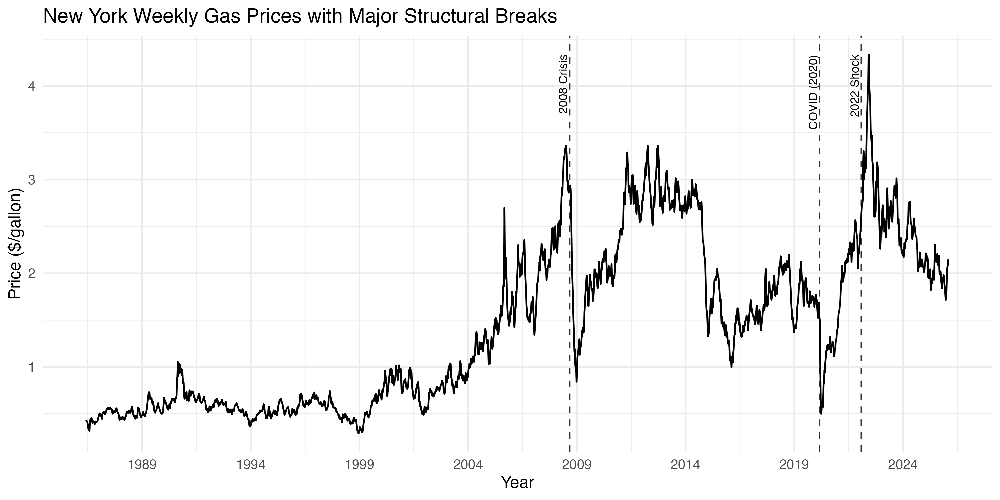
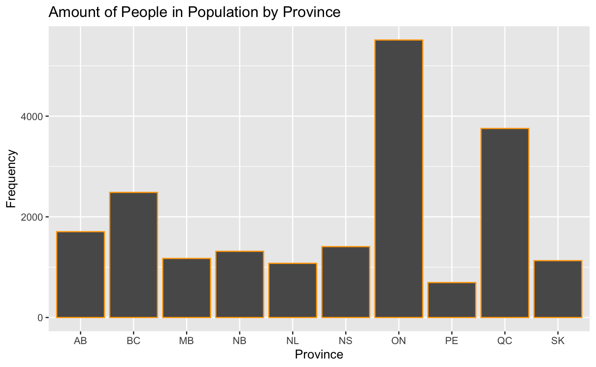
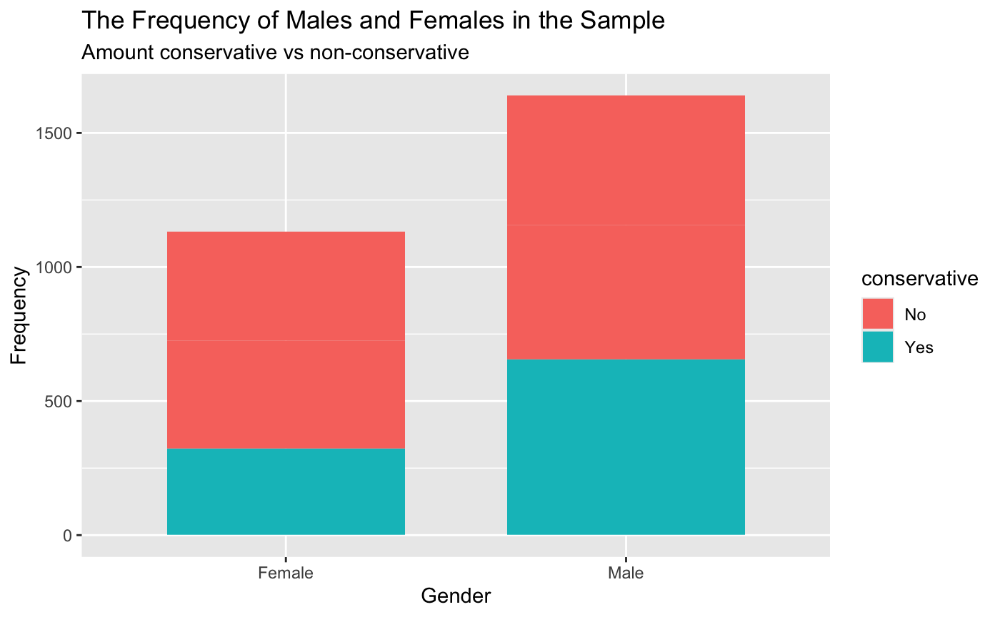
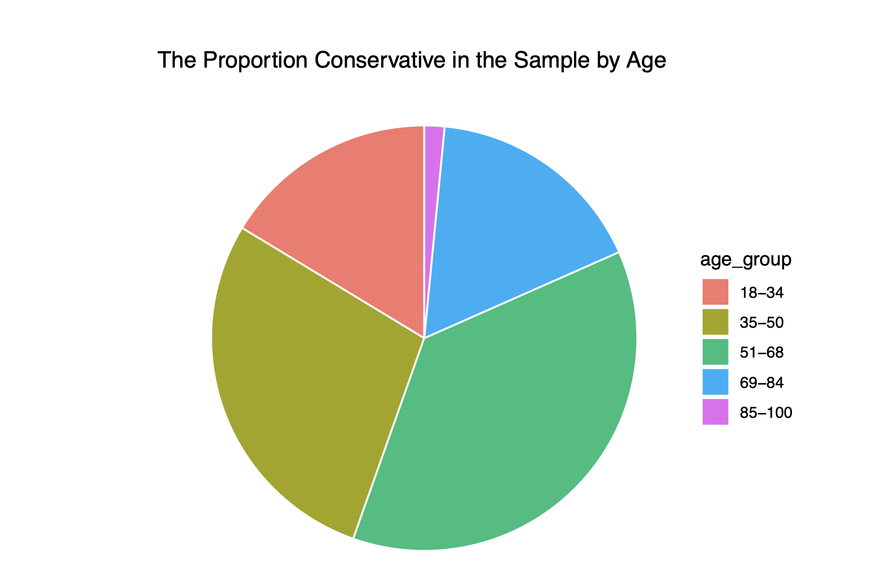
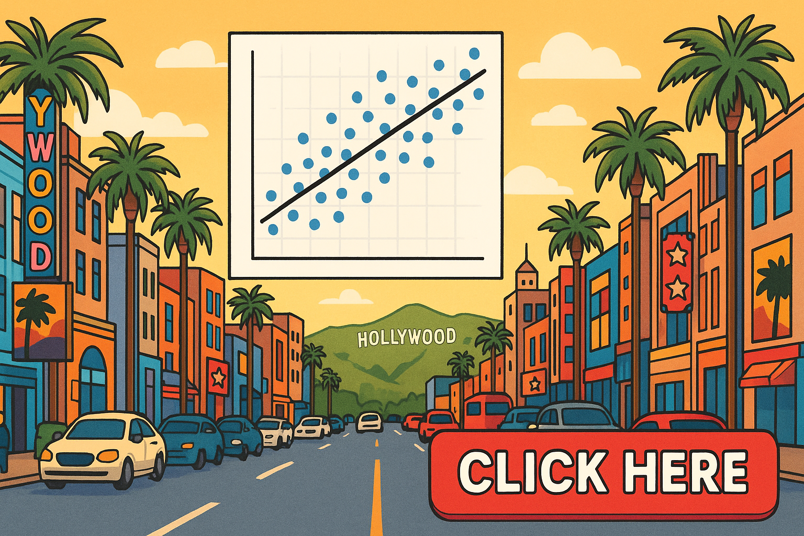

# Tayla's Data Projects
## About me 

I’m a Statistics graduate from the University of Toronto with a strong interest in data analysis.

I’ve worked with Excel, R, SQL, and Python to analyze datasets, build models, and evaluate performance, with a focus on producing clear insights. I’ve analyzed areas such as sales performance and trends over time, using structured approaches to solve problems and measure business impact.

I’m looking to start my career in data analytics, where I can keep building my skills and contribute to real business problems.

## Featured Projects 

- Developer Technology Trends Analysis (Python, SQL)
- Retail Trial Analysis (Excel) 
- Gas Price Forecasting (R) 
- Election Vote Modeling (R)
- Modeling House Prices (R) 

# Developer Technology Trends Analysis

#### Overview 

Analyzed data from the Stack Overflow Developer Survey to identify emerging trends in programming languages, databases, compensation, and job satisfaction. The project involved cleaning and preparing survey data, performing exploratory analysis, building dashboards, and presenting findings to stakeholders.

#### What I Did

- Gathered and integrated data from APIs, web scraping, and survey datasets
- Cleaned, transformed, and validated data using Python and Pandas
- Performed exploratory data analysis and trend identification using SQL and Python
- Analyzed programming language, database, compensation, and job satisfaction trends
- Designed interactive dashboards in Google Looker Studio
- Communicated findings and recommendations through a PowerPoint presentation

#### Most Popular Programming Languages

JavaScript and Python remained among the most widely used programming languages, highlighting their continued importance across the industry.

#### Most Desired Programming Languages

Python, JavaScript, and emerging technologies showed strong future interest among developers.

#### Average Annual Salary by Programming Language

#### Key Results

- JavaScript remained the most widely used programming language among respondents
- Python continued to show strong demand among developers
- PostgreSQL and MySQL were among the most commonly used databases
- Compensation and job satisfaction varied significantly across respondent groups
- Emerging technologies showed growing interest among developers planning future career development

#### Tools 

Python (Pandas), SQL, Google Looker Studio, Data Cleaning, Data Wrangling, Exploratory Data Analysis, Dashboard Development, Data Visualization

#### Business Impact 

Demonstrates how survey data can be transformed into actionable insights to support workforce planning, technology strategy, and skills development decisions.

# Retail Trial Analysis 

<a href="https://github.com/taystantim/-Chip-Category-Trial-Analysis" target="_blank">
  <button>View Full Project</button>
</a>

#### Overview

I analyzed supermarket transaction and customer data to evaluate a store-level chip trial and identify which customer groups drove sales growth. The analysis was completed in Excel using control store comparisons and confidence intervals.

#### What I Did

- Cleaned and merged transaction and customer datasets
- Analyzed chip sales by life stage and affluence
- Selected control stores using historical sales patterns
- Compared trial stores against scaled controls
- Used confidence intervals to assess whether uplift was statistically meaningful
  
#### Sales Contribution by Customer Segment

Mainstream products dominate chip sales, especially among Older Families and Young Singles/Couples.

#### Trial vs Control Comparison

The trial generated ~$324 in incremental revenue over 3 months, representing a 13% uplift. The effect exceeded 3.05 standard deviations above pre-trial variation, indicating a statistically significant impact.

#### Key Insights 

- Mainstream and Budget families contributed the largest share of chip sales
- Budget customers purchased more frequently at lower price points
- The trial produced statistically significant uplift in some stores

#### Business Impact 

Demonstrates how trial performance can be evaluated before rollout using structured analysis and statistical validation.

#### Tools 

Excel, data cleaning, PivotTables, aggregation, control group analysis, confidence intervals

# Forecasting New York Harbor Gas Prices

<a href="https://github.com/taystantim/gas-price-forecasting" target="_blank">
  <button>View Full Project</button>
</a>

#### Overview

Analyzed long-term gasoline price data to model price trends and volatility, using time series methods to improve short-term forecasting and understand risk dynamics.

#### What I did 

- Applied log transformation and differencing to achieve stationarity (ADF testing)
- Compared multiple ARIMA models and selected the best fit using AIC
- Evaluated model performance using rolling one-step forecasts
- Performed residual diagnostics (Ljung-Box test) to validate model assumptions
- Modeled volatility using GARCH(1,1) to capture clustering and persistence

#### New York Harbor Gas Prices 1988-2026

ARIMA-based forecast of weekly gas prices with 95% prediction intervals. Uncertainty increases over longer horizons

#### Structural Breaks in Gas Prices

This chart highlights major structural breaks in the gas price series, including the 2008 financial crisis, the 2020 COVID shock, and the 2022 geopolitical energy shock. 

#### Key Results 

- Selected ARIMA(4,1,1) as the best-performing model based on AIC
- Achieved strong short-term accuracy (RMSE ≈ 0.047)
- Identified significant volatility clustering (ARCH test p < 0.001)
- Estimated volatility shock half-life of ~8 weeks, indicating persistent risk

#### Tools 

R (forecast, tseries, rugarch), ARIMA, GARCH, time series analysis, model diagnostics

# Predicting Conservative Vote Share in the Canadian Federal Election

<a href="https://github.com/taystantim/Predicting-Conservative-Vote-Share-in-the-Canadian-Federal-Election" target="_blank">
  <button>View Full Project</button>
</a>

#### Overview

This project used Canadian election and census data to estimate Conservative vote share using logistic regression and demographic weighting.

#### What I Did

- Cleaned and recoded survey variables
- Built a logistic regression model for Conservative support
- Applied provincial demographic weighting
- Visualized age, gender, and regional voting patterns

#### Provincial Weight Distribution

Ontario and Quebec heavily influence national vote share due to population size.

#### Gender vs Conservative Support

Male respondents showed higher support (41%) than females (29%), indicating a gender gap in voting behaviour.

#### Conservative Support by Province

Conservative support increases with age, peaking around 40% among respondents aged 51–68.

#### Key Results

- Estimated 34.7% Conservative vote share
- Found that province size strongly affects national outcomes
- Identified meaningful differences in support by age and gender

#### Tools 

R, logistic regression, weighting, survey data analysis, data visualization

# Video Project: Selecting the Best Predictor for the Median Housing Value of Calfornia Homes 

#### Overview 

Analyzed California housing data using regression to identify key drivers median housing value across California districts.

#### What I Did 

- Compared multiple predictors using regression analysis
- Evaluated model fit and explanatory power
- Identified the strongest predictor of housing value

#### Key Insight

Median income emerged as the strongest predictor of housing value, explaining a substantial proportion of variance across districts.

#### Tools 

R, regression analysis, model evaluation, data visualization

